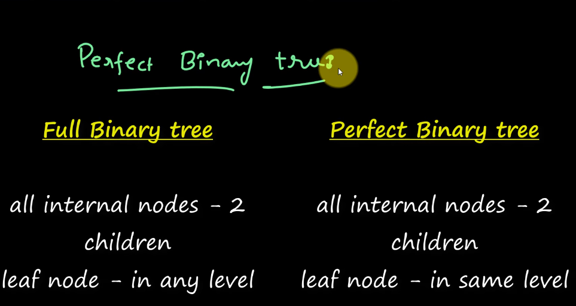

## Tree 

Characteristics of DataStructure 


Important Other Terms :

```

Root Node 

Child node 

Edge

Parent node 

Siblings -- Nodes at the Same Line 

Leaf Node , Terminal Node, External Node 

Path

Degree of node 
Degree of a tree 


```


Types of Tree Data Structure: 

https://www.geeksforgeeks.org/types-of-binary-tree/

```
Full Binary Tree - Strictly binary tree -- Except the leaf, all have two nodes (children)
Complete Binary Tree
perfect Binary Tree
Balanced Binary Tree 
Pathological Binary Tree 

```





Balanced Binary Tree - Height of left subtree - height of right subtree 

### Some Special Types of Trees:

```
Binary Search Tree
AVL Tree
Red Black Tree
B Tree
B+ Tree
Segment Tree
```