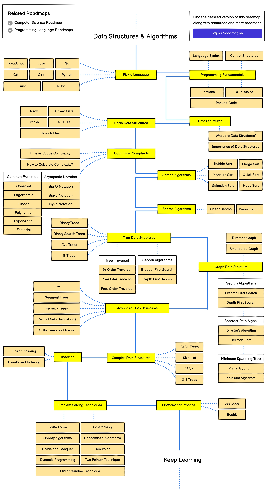

Sorting

- Bubble Sort
- Selection Sort
- Insertion Sort
- Merge Sort
- Quick Sort
- Heap Sort

Searching 

- Linear Search
- Binary Search 
- Hashing
- Tree-based Search  -- Binary , Binary Seach, AVL, B, B+ tree --- Traversal
- Graph-based Search --

For Top 100 Interview -- Preparation

[Prep Insta](https://prepinsta.com/top-100-codes/)

For Top 100 Interview -- Preparation

[Prep Insta](https://prepinsta.com/top-100-codes/)

